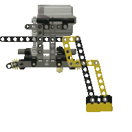

# Lego walkers

These are my experiments with building walking robots, theoretically, virtually, and physically, mostly using Lego Technics.

## Walkers

- [Walker1 ](Walker1)
- [Walker2](Walker2)
- [Physics simulations in Blender](BlenderWalker)
